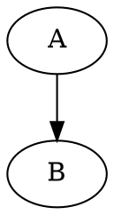

# remark-hpcc-graphviz-svg

[](https://npmjs.org/package/remark-hpcc-graphviz-svg)

A remark plugin to convert GraphViz code into SVG diagram. 

Modified from https://github.com/DCsunset/remark-graphviz-svg

## Features

* Custom language name for code blocks
* SVG Optimization using [svgo](https://github.com/svg/svgo)

## Installation

```
npm install remark-hpcc-graphviz-svg
```

Note: This package uses [ESM](https://gist.github.com/sindresorhus/a39789f98801d908bbc7ff3ecc99d99c).
Use Node 12+ and ESM import syntax to use this package.

## Usage

### Basic
```js
import remarkParse from "remark-parse";
import remarkRehype from "remark-rehype";
import rehypeStringify from "rehype-stringify";
import { remarkGraphvizSvg } from "remark-hpcc-graphviz-svg";
import fs from "fs";

const processor = unified()
  .use(remarkParse)
  .use(remarkGraphvizSvg)
  .use(remarkRehype)
  .use(rehypeStringify);

const content = await processor.process(
  fs.readFileSync("example.md")
);

console.log(content.value);
```

### Nextra

```js
import { remarkGraphvizSvg } from 'remark-hpcc-graphviz-svg';

const withNextra = nextra({
    theme: 'nextra-theme-docs',
    themeConfig: './theme.config.tsx',
    mdxOptions: {
        remarkPlugins: [
            remarkGraphvizSvg,
        ],
    },
})
```

Suppose the `example.md` has the following content:

````md
# Hello, world


````

Then the output of the above code is similar to the following:

```html
<h1>Hello, world</h1>
<p>
  <svg><!-- generated svg --></svg>
</p>
```


## Options

* `language`: Render GraphViz diagrams on specific language blocks. (Default: `graphviz`)
* `svgoOptions`: Override default svgo options. Set it to `null` to disable svgo. (Default: `defaultSvgoOptions`)

## License

GPL-3.0
